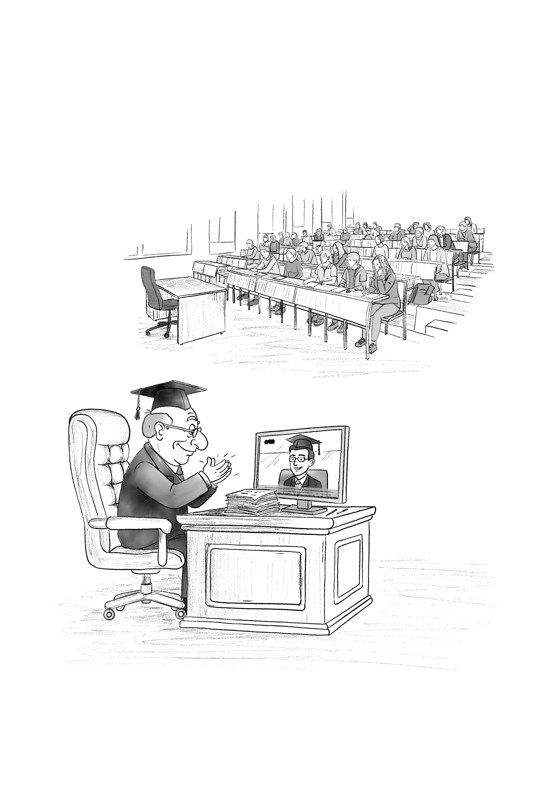

*Bir üniversite ne zaman çöker?*

*Yapılar ayakta kalırken etik ve kimlik yok olursa, bu iflas sayılmaz mı? Kurumsal bağımsızlıkların yitirildiği, yönetişim ilkelerinin yerini keyfiyetin aldığı bir dönemden geçiyoruz. Bu yalnızca yapısal bir çözülme değil; aynı zamanda akademik kimliğin metalaştığı, görünürlük odaklı performans baskısının merkezî konuma yerleştiği bir evreyi işaret ediyor.*

*Artık akademik üretim yalnızca yayınlarla değil; televizyon programları, popüler dergiler ve medya görünürlüğü gibi unsurlarla da ölçülüyor. Kapitalist üniversite modeli, akademisyenden yalnızca bilgi üretmesini değil, aynı zamanda izlenebilir olmasını ve bir ‘seyirlik figür’e dönüşmesini talep ediyor. Bilimsel yeterlilik, giderek izlenme oranlarıyla yer değiştiriyor. Bu değerlendirme, yalnızca bir eleştiri değil; aynı zamanda bir yüzleşme çağrısı. Çünkü akademiyi yeniden inşa etmek için, önce bu erozyonu tanımak gerekir.*

---
{width=80% fig-align="center"}

*Üniversite amfisi boş kâğıtlarla doluyken, alkışlar artık ekrandaki seyirlik figüre yöneliyor. 
Akademik kimlik bilgi üretiminden çok, izlenebilirliğe göre ölçülüyor; düşüncenin yerini 
performans, öğrenmenin yerini reyting alıyor.*

Üniversite Vardı. Şimdi Ne Var? 

Türkiye’de bir zamanlar üniversite vardı. “Vardı” diyorum çünkü bugün elimizde kalan yapı, yalnızca adıyla yaşayan ama işlevini büyük ölçüde yitirmiş bir kurumsal gövdeye dönüşmüş durumda.

Bu yazı, Antroposen Sohbetler programımda gazeteci Tuğba Tekerek ile gerçekleştirdiğim bir söyleşiye dayanıyor. Tuğba Hanım’ın 2023 tarihli kitabı Taşra Üniversiteleri: AK Parti’nin Arka Kampüsü, Türkiye’deki üniversite modelinin geçirdiği dönüşümü taşra üniversiteleri üzerinden görünür kılıyor. Öğrenci kulüplerinden kampüs mimarisine, yurt düzenlemelerinden akademik kadro politikalarına kadar geniş bir çerçevede üniversitenin bugünkü hâline ayna tutuyor.
Bu yazıda, o söyleşiden hareketle Türkiye’de üniversite kavramının geçirdiği evrimi tartışmak istiyorum. Ancak önce, üniversitenin evrensel düzeyde ne anlama geldiğini hatırlamakta fayda var.

Üniversite, yalnızca öğretim faaliyetlerinin yürütüldüğü bir mekân değil; fakülteleri, enstitüleri ve araştırma merkezleriyle birlikte bilimsel bilgi üretiminin kurumsal hafızasını taşıyan bir yapıdır. Bu yapı, kamu tüzel kişiliğine sahiptir ve temelini bilimsel özerklik ilkesinden alır. Türkiye’de bu anlayış, 1933 reformuyla şekillenmeye başlamıştır. Reformun temelini oluşturan metin ise, 1932 yılında Cenevre Üniversitesi’nden Prof. Albert Malche’nin Darülfünun üzerine hazırladığı rapordur. Malche, öğretim üyelerinin bilimsel donanım eksikliklerinden yayın yetersizliğine, yabancı dil sorunundan yönetsel bağımlılığa kadar birçok sorunu saptamıştır. En çarpıcı tespiti ise, üniversitenin Millî Eğitim Bakanlığı’na bağlı olmasının bilimsel özerklikle bağdaşmadığı yönündedir.

Mustafa Kemal Atatürk’ün Malche raporuna düştüğü not çarpıcıdır:
“Şahsi mütalaa ve araştırmaya sevk eden tarzda tedris yok. Ansiklopedik malumat veriliyor.”

Bu not, üniversitenin yalnızca aktarıcı değil, düşündürücü ve araştırmaya yönlendirici bir yapıya kavuşması gerektiğine işaret eder. Hemen ardından gelen tasfiye süreci ve 1933 reformu, bu düşünce doğrultusunda şekillenir. İstanbul Üniversitesi’nin ilk kadrosu; Darülfünun’dan kalan bazı hocalar, Avrupa’da eğitim görmüş genç akademisyenler ve Nazi Almanyası’ndan kaçan göçmen bilim insanlarından oluşur. Kurulan yapı, ders vermekten çok düşünce üretmeye ve bilimsel araştırmaya dayalı, yaratıcı ve özerk bir üniversite hayalini temsil eder.

Ancak bu reform, yalnızca bilimsel değil; aynı zamanda ideolojik bir yön de taşımaktadır. Niyazi Berkes’in de vurguladığı gibi, bu adım aynı zamanda geleneksel-din temelli toplum yapısından laik, ulus-devlet temelli bir yapıya geçişin simgesel bir hamlesidir. Üniversitenin modernleşmesi, aynı zamanda Cumhuriyet’in ideolojik temellerinin kurumsallaşması anlamına gelmiştir. Devlet ideolojisinin üniversite aracılığıyla topluma aktarılması, reformun önemli hedeflerinden biridir.

Burada önemli olan, ideolojinin varlığı değil, onun bilimi nasıl etkilediğidir.

Tarih bize, ideolojinin bilime yön verdiğinde çağdaşlaşma adına nasıl bir ilerleme sağlanabileceğini Cumhuriyet’in erken döneminde, 1933 üniversite reformuyla gösterir. Ancak ideoloji merkezden sapıp mutlaklaştığında —Stalin döneminde genetiği ideolojik çizgiye göre şekillendiren Lysenko örneğinde olduğu gibi— bilimsel yöntem ve eleştirel düşünce ortadan kalkar; sonuç ise yıkımdır. 1933 reformu ise bu açıdan Berkes’in de vurguladığı gibi “radikal değil, devrimsel” niteliktedir: Bilimi ideolojik amaçlara feda etmeden, toplumu Batı uygarlığına yönlendirmeye çalışan bir dönüşüm projesidir. ^[Niyazi Berkes, Türkiye’de Çağdaşlaşma adlı eserinde Atatürk devrimlerini “radikal” değil, “devrimsel” olarak tanımlar. Bu devrimler, geçmişteki tereddütleri ve geleneksel yapıyı kökten ortadan kaldırarak, Türk toplumunu Doğu yörüngesinden çıkarıp Batı uygarlığıyla bütünleştirmeyi hedefler. Berkes’e göre üniversite reformu da bu sürecin kurumsal taşıyıcısıdır. Üniversitenin yeniden yapılandırılması, din-devlet ayrımının kesinleşmesi, anayasal devletin inşası ve laikleşmenin derinleşmesi için zorunlu bir adımdır. Reform, bilimsel ilerlemeyi destekleyen ama aynı zamanda Cumhuriyet’in ideolojik temelini kurumsallaştıran bir dönüşüm örneği olarak değerlendirilir. Bkz. Berkes, Türkiye’de Çağdaşlaşma, YKY, 2002.]

Yine de bu durum, üniversitenin ideolojiden bütünüyle arındırılabileceği bir ütopyayı savunmak anlamına gelmemeli. Aksine, ideolojik müdahaleyle bilimsel özerklik arasındaki dengeyi tarihsel bağlamlarıyla birlikte düşünmek gerekir. Çünkü üniversite tarih boyunca hem modernleşmenin hem de ideolojik yönlendirmenin merkezi olmuş; zaman zaman da iktidarların meşruiyet kaynağı olarak kullanılmıştır. Bu nedenle, üniversitenin hem bilimsel hem etik özerkliğini koruyacak bir kurumsal düzenleme gereklidir.

Aradan geçen neredeyse bir yüzyılda, Türkiye’deki üniversitelerde öğretim üyesi sayısı 250’den 200 bine yaklaşarak devasa bir yapıya evrildi. Ancak bu hızlı büyüme, aynı ölçekte bir kurumsal derinlik ya da bilimsel üretim artışıyla desteklenmedi. Bugün geldiğimiz noktada, üniversiteler düşünce üreten özerk yapılardan çok, çoğu zaman yalnızca diploma dağıtan idari organizasyonlara dönüşmüş durumda.

Bu dönüşüm, yükseköğretim sisteminin düşünsel ve etik temeller açısından da ciddi bir aşınma sürecine girdiğini gösteriyor. Özellikle son yirmi yılda, yükseköğretim alanında uygulanan politikalar, üniversitelerin ideolojik olarak şekillendirilmesine ve eleştirel düşünceye mesafeli, merkezî kontrolü esas alan bir modelin yerleşmesine yol açtı. Bu süreçte, akademik özerklik ilkesinin zayıflamasıyla birlikte üniversiteler, bilimsel üretimden çok idari sadakat üzerinden tanımlanır hâle geldi.

Oysa 1933 reformunun ardındaki tahayyül, bilimsel düşünceyi ideolojik dönüşümle buluştururken özerkliğe bütünüyle sırt çevirmemişti. Bugünse karşı karşıya olduğumuz model, üniversiteyi kurumsal kapasitesinden ve tarihsel işlevinden koparan daha daraltıcı bir yönelimi temsil ediyor.

Bu dönüşümü sadece bugünün siyasal iklimine bağlamak yerinde bir tespit gibi görünse de eksik kalabilir. Cumhuriyetin kuruluşundan itibaren eğitim politikaları, bir yandan toplumu çağdaşlaştırmayı hedeflerken, diğer yandan da ideolojik bir homojenlik inşa etmeyi amaçlamıştır. Bugün bu modelin bir benzeri tam aksi yönde işletiliyor gibi görünüyor. Türkiye’de eğitim sistemi Fransız lycée modeli temelinde biçimlendirilmiş bir sistemdir; laiklik ve milliyetçilik ekseninde pozitivist bir kurguya oturtulmuştur. Bu yapı, eleştirel düşünceden çok ezberi, çoğulculuktan çok uyumu öncelemiştir. Üniversite de bu zihinsel mimarinin zirve noktası olarak kurgulanmış; topluma aktarılan modernleşme anlatısının taşıyıcısı olmuştur. Belki de bu nedenle üniversiteler, 1933 reformu sonrasında Millî Eğitim Bakanlığı’na bağlılığından kurtulamamıştır. 

Ancak bu aktarım sürecinde üniversite, hem bilim üretiminden hem de pedagojik çeşitlilikten uzaklaşmış; zamanla diyalog yerine monoloğun, araştırma yerine törenin mekânına dönüşmüştür. “Köy Enstitüleri radikal değil, devrimsel bir projeydi” denirken bile bu sistemin çerçevesi, devletin kültürel mühendisliğini aşmamıştır. Yani Köy Enstitüleri, ezberci eğitime karşı yepyeni bir yaklaşım getirse de, nihayetinde bu proje de bireyleri özgürleştirmekten çok, modern ulus-devletin ihtiyaç duyduğu vatandaş tipini üretmeye odaklıydı. Bu yönüyle, kapsayıcı bir eleştirel düşünce iklimi yaratmak yerine, toplumu merkezî değerlerle biçimlendirme hedefini sürdürdü. Üniversitenin bugün yaşadığı kimlik krizini anlamak için, bu tarihsel devamlılığı da göz önünde bulundurmak gerekir. 

Bu tarihsel tek-tipleştirme eğilimi bugün, ideolojik yönü farklı ama benzer bir merkeziyetçilikle yeniden üretiliyor. Özgür düşüncenin yerine sadakati, eleştirel üretimin yerine sembolik itaati koyan bu yeni model, üniversitenin kurumsal kimliğini ve işlevini derinden sarsarken aşınmaya da neden oluyor. Bu dönüşümün etkilerini yalnızca yapısal değil, duygusal düzeyde de görebiliyoruz.

Prof. Lale Akarun’un Boğaziçi Üniversitesi’nin durumuna ilişkin değerlendirmesi ^[Lale Akarun, “Boğaziçi Üniversitesi’nin Yasını Tutmak”, YetkinReport, 14 Aralık 2023. Yazıda Akarun, Boğaziçi Üniversitesi’nin yaşadığı kurumsal çöküşü beş evreli yas süreciyle anlatarak, akademik hafızanın nasıl sistemli biçimde silindiğine tanıklık ediyor. Konferans salonlarının makam odalarına dönüştürülmesinden laboratuvarların tasfiyesine uzanan bu süreç, yalnızca fiziksel değil, simgesel bir yok oluşa da işaret ediyor.], bu aşınmanın hem içerden hem de dışardan nasıl algılandığının net bir göstergesi. Akarun, üniversitenin ölümünü, yas sürecinin tüm evrelerini yaşayarak anlatıyor: inkâr, öfke, pazarlık, depresyon ve sonunda gelen kabulleniş. Bir araştırma üniversitesinin nasıl adım adım işlevsizleştirildiğini, laboratuvarların ve konferans salonlarının nasıl makam odalarına dönüştürüldüğünü, gündelik anlamda akademik hayatın simgesel ve fiziksel olarak nasıl geri plana itildiğini çarpıcı bir biçimde gözler önüne seriyor. Bu anlatı yalnızca Boğaziçi’nin değil, Türkiye üniversitelerinin genelinin karşı karşıya olduğu kurumsal hafıza kaybının ve bilimsel sürekliliğin kesintiye uğradığı bir dönemin de tanıklığıdır.
Bugün üniversiteler, ortaöğretimin eksikliklerini telafi eden kurumlara dönüşmüş durumda. Akademisyenler, adeta “lisedeki eksikleri tamamlayan eğitmenler” gibi konumlanıyor. Üniversiteler artık hem bilim üretme misyonunu yitirirken, evrensel ölçütlerle öğretim yapma iddiasından da uzaklaşıyor.

Tuğba Tekerek’in kitabında ^[Tuğba Tekerek, *Taşra Üniversiteleri: AK Parti'nin Arka Kampüsü* (İstanbul: İletişim Yayınları, 2023). Tekerek’in saha gözlemlerine ve uzun görüşmelere dayanan bu çalışması, Türkiye’de taşra üniversitelerinin akademik ve sosyal hayatını ayrıntılı biçimde analiz eder.] aktardığı Bartın Üniversitesi Moleküler Biyoloji Bölümü örneği çarpıcı: “YKS’de biyoloji, fizik ve kimya testlerinden sıfır net yapan öğrencilerin bu bölüme yerleştiğini öğrendik. “Peki, bu öğrenciye nasıl moleküler biyoloji öğreteceğiz?” sorusu cevapsız kalıyor. Üstelik bu öğrenciler mezun olabiliyor. Öğrenci başarısız olduğunda çoğu zaman CİMER’e şikâyet ediyorlar; geçme notu sınırının da kaldırılmasıyla birlikte bu sorun artık sistematikleşmiş durumda.”

Eksi 7,5 Türkçe netiyle bir üniversitenin Türk Dili ve Edebiyatı bölümüne yerleşen öğrenci örneği, kitabın yayımlandığı yıl kamuoyunun en çok konuştuğu vakalardan biriydi. Bölümde ders veren bir akademisyenin şu sözleri, durumun vahametini özetliyor:

“Buraya geldiklerinde tek bir kitap okumamışlardı. Mezun olurken bir kitap okutmaya çalışıyorum, ama çoğu zaman başaramıyorum.”

Benzer bir tabloyu fen bilimleri cephesinden bir moleküler biyoloji hocası da dile getiriyor:

“Bir öğrencinin bilgiyi öğrenme kapasitesi yoksa, ilgisi yoksa, öğretim üyesi ne anlatabilir?”

Bir diğer öğretim üyesi ise durumu acı bir netlikle ifade ediyor:

“Ders anlatıyormuş gibi yapıyoruz, onlar da dinliyormuş gibi davranıyor.”
Her ile üniversite açma politikası, zamanla bilimsel bir vizyondan saparak siyasal bir alışkanlığa dönüştü; elimizde kalan ise, çok sayıda ama düşünsel açıdan yoksullaşmış üniversiteler oldu. Tuğba Tekerek’in aktardığı Şebinkarahisar örneği bunu çok iyi özetliyor: “Moda Tasarımı Yüksekokulu’nun açıldığı bu ilçede kumaş, aksesuar ya da staj imkânı yok. Ama öğrenci var, çünkü öğrenci ilçeye ekonomik canlılık getiriyor. Üniversite artık bilimsel değil, ekonomik bir yatırım nesnesi hâline gelmiş durumda.”

Giresun Otelciler ve Kahveciler Odası’nın, üniversite geç açıldı diye yönetime itiraz ettiğini biliyor muydunuz? Çünkü “fındık rekoltesi düştü, şehirde öğrenci dışında para sirkülasyonu yok” diyerek üniversiteyi doğrudan bir gelir kalemi olarak görüyorlar. Böylece üniversite, bilimsel üretim ve düşünsel katkıdan çok, yerel ekonomik döngüye katkı sunması beklenen bir yapıya dönüşüyor.

Taşra üniversitelerinde temizlik görevlisi alımı için dahi rektörün konuşma yaptığı, kura sistemleriyle biçimsel şeffaflık görüntüsü verildiği ve sonunda siyasi sadakate göre mülakatla eleme yapılan bir sistem işliyor. Tuğba Tekerek, bu süreçlerin çoğu zaman iktidara yakınlıkla belirlendiğini aktarıyor. Böyle bir atmosferde, akademik kadroların belirlenmesi de benzer şekilde belirli siyasi eğilimler etrafında şekilleniyor; böylece düşünsel çeşitlilik değil, tek yönlü bir ideolojik inşa öne çıkıyor.

Bu üniversiteler aynı zamanda, iktidarın entelektüel kadrosunu “inşa” ettiği alanlara dönüşmüş durumda. Yerel düzeydeki bazı akademisyenler, Kürt meselesinden kadın politikalarına dek çeşitli veriler toplayarak, bunları milliyetçi ve muhafazakâr bir süzgeçten geçirerek raporlaştırıyor; bu içerikler karar verici mercilere taşınıyor. Buradaki amaç açık: “yerli ve millî” çizgide, dindar ve milliyetçi bir nesil yaratmak.

Türkiye Cumhuriyeti, 90 yıl önce üniversiteyi özgür düşüncenin, bilimsel üretimin ve toplumsal ilerlemenin temeli olarak görüyordu. Bugün ise geldiğimiz noktada, sadece bu ideallerin terk edildiğini değil; aynı zamanda Aziz Nesin öykülerine bile taş çıkartacak olaylarla karşı karşıya kaldığımızı üzülerek görüyoruz.

Çözüm şimdilik bir soru işaretinden ibaret. Belki de yeniden başlamak. Ortaöğretimde sağlam bir eğitim zemini kurmak ve üniversiteye girişte adil, ölçülebilir kriterleri esas almak ilk adım olabilir. Ardından, 1933’teki kurucu iradeyi hatırlayarak ama bugünün gerçeklerini gözeterek, yeni bir üniversite reformunu düşünmek gerekiyor.

Tuğba Tekerek ile gerçekleştirdiğim ve bu yazıya kaynaklık eden söyleşi, 26 Aralık 2023 tarihinde Açık Radyo’da –bugünkü adıyla Apaçık Radyo’da– yayınlandı. Bu metin, söz konusu programın yazılı bir uzantısı olarak okunabilir. Bu vesileyle Taşra Üniversiteleri: AK Parti’nin Arka Kampüsü kitabını, üniversitenin bugünkü hâlini anlamak isteyen herkese içtenlikle tavsiye ederim.