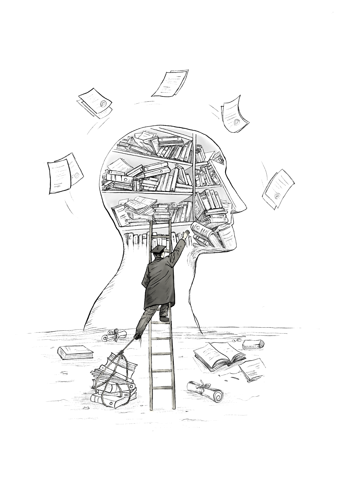

“*Hatırlamak biriktirmek değil, yön tayin etmektir. Aksi hâlde düşünce, hafızanın enkazı altında kalır.*” 
— Akademi Unutmazsa’nın not defterinden

{width=80% fig-align="center"}

*Bugünün belgeleri, düşüncenin önüne yığılmış durumda. Sayılar, tablolar, dosyalar... Akademik hafıza, yön tayin edemediğinde geçmiş birikim değil, düşünsel birikinti üretir. Tıpkı Funes’in zihni gibi: eksiksiz ama işlevsiz. Hatırlamak bu yüzden seçmektir; tabii ulaşabilirse, yoksa düşünce yığının altında kalır.*

Üniversitede öğretmek, düşünceye özgürlük tanımak kadar, hatırlatmakla da ilgilidir kuşkusuz. Ama hatırlamak, her zaman yol gösterici midir? Belki de, bazen anlamlı bir unutmaya da ihtiyaç duyarız. Çünkü hafıza sadece geçmişi taşımakla kalmaz; yönünü bulamayan bir birikim, düşüncenin önüne de geçebilir.

Akademinin bütününü ele aldığımızda, elbette geçmişe dayalı bir süreklilikten ve bunun taşıyıcısı olan kurumsal birikimden söz edebiliriz. Bu kitap boyunca da, bu birikimin yalnızca korunması değil, ideal akademiden sapmamak için nasıl işlevsel kılınabileceğini; üniversite içindeki tüm bileşenlerin, ortak hatırlama süreçlerine sahip çıkarak kendi konumlarını nasıl anlamlandırmaları gerektiğini farklı boyutlarıyla tartışmaya çalıştım.

Ancak bu noktada, geçmişin sadece yığılarak oluşturduğu birikimsel bir yapıdan ibaret olmadığını vurgulamak gerekir. Zira hafızayı anlamlı kılan, onun nasıl işlendiğidir. Eğer akademi geçmişle kurduğu ilişkiyi sadece bir taşıma, depolama işlevine indirgerse, onun taşıdığı etik ve düşünsel yükü göz ardı etmiş olur. Oysa hatırlama eylemi, ancak soyutlama, eleme ve dönüştürme kapasitesiyle canlıdır. Bu da demektir ki akademi, geçmişin izlerini yalnızca saklamamalı; onlarla düşünmeli, yön tayin etmeli ve kimi zaman bilinçli bir unutmayı da göze alabilmelidir.

İşte bu noktada Jorge Luis Borges’in “Funes the Memorious” adlı öyküsü, hatırlamanın doğasına dair eşsiz bir mecaz sunar. Borges, her ayrıntıyı unutmadan zihninde tutan ama hiçbir anlam çıkaramayan bir karakter yaratır. Funes’in zihni, geçmişin her görüntüsünü eksiksiz biçimde saklayan dev bir arşiv gibidir; ancak bu arşivde ilişki kurmak, soyutlama yapmak, kavramsal çerçeve inşa etmek mümkün değildir. Bu öykü, özellikle hafıza ve kavramsal temsil üzerine çalışan Arjantinli nörobilimci Rodrigo Quian Quiroga’nın da dikkatini çeker. Onun, yıllar sonra bilimsel çalışmalarının önsezisel bir izdüşümünü bu anlatıda bulması rastlantı değildir; çünkü Borges, zihinsel birikimin yalnızca hatırlamakla değil, seçmekle, unutmakla ve anlam inşa etmekle ilgili olduğunu çok önceden sezmiştir.

Burada, Borges’in Funes’i üzerinden üniversitelerin de benzer bir tehlikeyle karşı karşıya kalabileceğini tartışmak istiyorum: her şeyi kaydeden ama hiçbir şeyi kavramsallaştıramayan; geçmişi titizlikle saklayan ama geleceğe dair yön tayin edemeyen bir akademik yapı. Funes’in zihinsel dünyası, yalnızca arşivler, özgeçmişler, gösterge tabloları ve istatistiklerle varlığını sürdüren ama düşünsel üretim yetisini yitirmiş bir üniversiteyi anımsatıyor. O hâlde şu soruyla yola çıkabiliriz: Akademi yalnızca hatırlıyor mu, yoksa gerçekten düşündüğü ve dönüştürdüğü bir geçmişle mi yaşıyor?

Akademik yapı içinde geçmişle kurulan ilişki, çoğu zaman kayıt tutmakla özdeşleşir: ders programları, idari belgeler, kişisel yayın listeleri, atıf indeksleri, performans ölçütleri… Bu tür dokümanlar, ilk bakışta bir sürekliliğin izi gibi görünse de, aslında tekrar eden bir veri döngüsünden fazlası değildir. Önemli olan yalnızca neyin saklandığı değil, o saklananların nasıl yorumlandığıdır. Kavramsal zayıflık da işte burada başlar: Birikim, yön tayin etmediğinde düşünce savrulur. Geçmişin yükü giderek ağırlaşır; bağ kurulamayan bilgi birikimi, düşüncenin altında bir enkaza dönüşür.

Akademi yalnızca “ne yapıldığını” belgeleyen bir mekanizmaya dönüştüğünde, “neden” ve “nasıl” gibi kurucu soruları ihmal etmeye başlar. Sayılar, sıralamalar ve çizelgeler; kurumsal sürekliliği temsil ettiği varsayılsa da, çoğu zaman ilişkisiz ve bağlamsız veri kümeleridir. İşte Borges’in Funes’i, bu durumu çarpıcı biçimde yansıtır: her ayrıntıyı eksiksiz hatırlayan ama bu ayrıntılar arasında hiçbir bağ kuramayan bir hafıza… Kavram yoktur, soyutlama yoktur, yön yoktur. Akademi de benzer bir yöne sürüklenebilir: arşivler tutulur, başarı belgeleri art arda sıralanır, ama düşünsel bütünlük kaybolur.

Bu nedenle, geçmişin izlerini taşıyan yapılar yalnızca varlık göstergesi olarak kalırsa, akademi anlam değil tekrar üretir. Yön tayin etmeyen hatırlama, sonunda kendi ağırlığı altında çökebilir. Sorulması gereken şudur: Üniversite geçmişi yalnızca taşıyor mu, yoksa onunla birlikte düşünebiliyor ve yeniden kurabiliyor mu?

Jorge Luis Borges’in Funes karakteri, yalnızca edebi bir kurgu değil, insan zihninin sınırlarına dair derin bir sorgulamadır. Her şeyi, her ayrıntıyı unutmadan hatırlayan bu karakter, düşünme yetisini tam da bu yüzden kaybetmiştir. Çünkü düşünmek, belirli şeyleri dışarda bırakmayı; soyutlamayı, önceliklendirmeyi, ilişkilendirmeyi gerektirir. Funes’in zihninde ayrıntıların gürültüsü o kadar yüksektir ki, kavramlara yer kalmaz.

Bu zihinsel aşırılığın gerçek hayattaki yansımasını, 20. yüzyıl ortası Rus psikoloğu psikolog Alexander Luria'nın incelediği bir vakada görürüz: Solomon Shereshevskii. Olağanüstü hafızasıyla tek seferde duyduğu sayıları, sözcükleri, renkleri yıllar sonra hatırlayabilen Shereshevskii, aynı zamanda soyutlama yapmada zorlanır. Ezberlediği bilgiler arasında kavramsal bağ kuramaz; örüntüleri fark edemez. Tıpkı Funes gibi, onun zihni de ayrıntılarla doludur ama düşünce üretiminden uzaktır.

Borges’in edebi sezgisi ile Luria’nın bilimsel gözlemi burada kesişir. Ve bu kesişme bize bir uyarı sunar: her şeyi hatırlamak, her şeyi anlamak değildir. Aksine, hatırlama eylemi düşünsel süzgeçlerden geçmediğinde, insan zihnini ve dolayısıyla kurumsal yapıları işlevsizleştirebilir. Akademi için bu durum özellikle kritiktir: bilgi biriktirmekle düşünce üretmek arasında ayrım yapamayan bir üniversite, Shereshevskii’nin zihnine; düşünmeyi, eleştirmeyi ve ilişkilendirmeyi unutan bir yapı ise Funes’in iç dünyasına benzeyebilir.

Unutma, çoğu zaman olumsuz bir çağrışım taşır: bir yitirme, bir kusur ya da bir eksiklik olarak düşünülür. Oysa unutmak, tıpkı hatırlamak gibi, seçici bir bilinç eylemidir. Hatırlanan kadar unutulan da düşünsel yapının parçasıdır. Nietzsche, hafızanın aşırılığıyla malul bir insanın eylemde bulunamayacağını, her şeyin ayrıntısında boğulacağını söyler. William James ise daha da ileri gider: “Her şeyi hatırlasaydık, çoğu zaman hiçbir şeyi hatırlamamış kadar çaresiz olurduk.”

Akademik kurumlar da benzer bir tehlikeyle yüz yüzedir. Geçmişin her izini muhafaza etmeye çalışmak, bir süre sonra yön kaybına neden olabilir. Arşivler dolup taşar, dosyalar çoğalır, geçmiş belgelenir; fakat bu belgeler düşünceye dönüşmedikçe yalnızca yığıntı hâline gelir. Oysa etik bir hatırlama, yalnızca “ne oldu”yu değil, “neden önemliydi”yi de içerir. Ve bu aynı zamanda unutmayı da içerir: bilinçli, düşünsel, kavramsal bir unutma.

Türkiye’de akademik hafıza, bu açıdan oldukça çelişkili bir yapıya sahiptir. Reformlar, müdahaleler, kırılmalar… Bu tarihsel anlar kaydedilmiş olabilir; ancak içselleştirilmedikçe yalnızca suskunluk üretir. Barış Akademisyenleri örneği bu açıdan çarpıcıdır: Hatırlanması istenmeyen, ancak unutuldukça akademinin kendi vicdanını yitirdiği bir kolektif çıkış. Aynı şekilde, Hüseyin Nail Kubalı’nın yaşadığı dışlanma da hatırlama/unutma ikiliğinin tarihsel katmanlarını açığa çıkarır.

Hatırlamak sadece belge tutmak değil, pozisyon almaktır. Unutmak ise her zaman bir vazgeçiş değil, bazen bir direnç biçimidir.

Başlangıçta Borges’in “Funes the Memorious” öyküsünü bir uyarı olarak ele almıştım. Hatırlamak, düşünmek değildir. Kaydetmek, kavramsallaştırmak değildir. Anlam, ancak seçme, ayıklama ve ilişkilendirme üzerinden doğar. Funes her şeyi hatırlıyordu ama hiçbir şeyi anlayamıyordu. Akademik yapılar da her şeyi belgeleyip hiçbir şeyi dönüştüremediğinde, benzer bir düşünsel tıkanma yaşar.

Bu kitap boyunca, akademik değer erozyonunu hem yapısal hem etik boyutlarıyla tartışmaya çalıştım. Sessizlik ile hatırlama arasındaki gerilim, geçmişin yalnızca korunacak bir yığın değil, dönüştürülecek bir anlam alanı olduğunu gösteriyor. Kurumsal hafıza, yalnızca olan biteni kaydetmekle yetinemez; neyin neden hatırlandığını, neyin neden unutulduğunu sorgulamalıdır. Hatırlamak, bir pozisyon almaksa; unutmak da bir vazgeçiş değil, bazen bir direnme biçimidir.

Psikanaliz bize şunu öğretir: bastırılan şey, mutlaka geri döner, çoğu zaman biçim değiştirerek ve tanınmaz hâlde. Bireysel bilinçdışında olduğu gibi, akademik yapılar da yüzleşilmeyen geçmişle tamamlanamaz. Unutulmak istenen her şey, kurumsal bedenin içinde iz bırakır; ya sessizlik olarak ya da yön kaybı olarak. O yüzden üniversitelerin geçmişle kurduğu ilişki, aynı zamanda kendi etik pusulalarını yeniden inşa etme biçimidir.

Bugün akademi, kimi zaman Funes’in zihnini andıran bir yapıya bürünüyor: geçmişi saklıyor ama yön tayin edemiyor. Sayılar, belgeler, istatistikler; görkemli özgeçmişler ve dolup taşan arşivler arasında etik ilkeler silikleşiyor, kavramsal düşünce zayıflıyor. Oysa düşüncenin sürekliliği yalnızca birikimle değil, o birikimin dönüştürülmesiyle mümkündür. Bu dönüşüm ise, akademik özgürlüğün ve üniversite özerkliğinin güvence altında olduğu ortamlarda anlam kazanır; çünkü düşünsel yön tayini, baskıdan değil özgürlükten doğar.

Eğer bu kitap bir çağrıysa, bu çağrı yalnızca hatırlamaya değil; hatırlananı dönüştürmeye de yöneliktir. Akademi, geçmişine sahip çıktığı kadar, bu geçmişle ne yapacağına da karar vermelidir. Çünkü asıl mesele, geçmişte ne olduğunu bilmek değil; o geçmişle birlikte bugünü nasıl kurduğumuzdur. Ve belki de bazen, bugünü kurmak için unutmaya da ihtiyaç vardır; anlamlı, seçici, yön verici bir unutmaya. Aksi hâlde geçmiş, yönümüzü tayin eden bir pusula olmaktan çıkıp, bizi durduran bir yüke dönüşebilir.