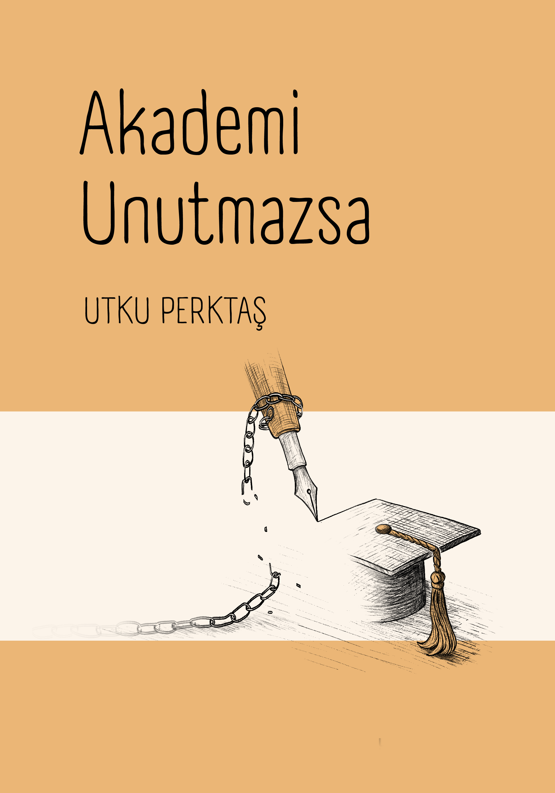

## Türkiye’de Üniversiteyi Hatırlamak  
### Bellek, Etik ve Akademik Kültür Arasında Bir Arayış

**Utku Perktaş**

Çizimler: Yasemin Sayıbaş Akyüz

Nisan 2026

Türkiye’de üniversitenin gelecekte nasıl hatırlanacağını ya da nasıl unutulacağını kimse bilemez. Üniversite yalnızca bir kurum değil; aynı zamanda akademinin toplumsal ve zihinsel yüzüdür. Böylesi bir belirsizlikte yapılabilecek en anlamlı şey, elimizde kalan akademi deneyimini ve onun hatırlama biçimlerini kayda geçirmek, bugünün akademisinin hafızamızda bıraktığı izleri yitirmeden kavramlarını ve değerlerini bugünden tanımlamaktır.

<blockquote class="about-quote">
“*Bilgi talebinin çöküşü, üniversitenin tarihsel işlevinin unutulması ve yayın endüstrisinin akademik ritmi bozması, kurumsal hafızanın erozyonuyla birleşince akademi artık kendi hikâyesini bile hatırlayamayan bir kuruma dönüşüyor.*”
 — Akademi Unutmazsa’nın not defterinden
</blockquote>

<blockquote class="about-quote">
“*Tornavidanın ne işe yaradığı sathiliğinde bir bakışın üniversiteye hâkim olduğu günlerde yaşıyoruz. Utku Perktaş, uyurgezerleşmiş bir akademiye sesleniyor: Unuttuğumuzu hatırlatmak için.*”
 — Gündüz Vassaf’ın önsözünden
</blockquote>

## Görüşler

<blockquote class="endorsement">
Yirmibirinci yüzyılın ilk çeyreğinde akademinin üzerindeki siyasî ve ticarî baskıların ağırlaşması, üniversitelerin mevcut halleriyle varlık nedenleri arasındaki makasın açılması Türkiye’ye özgü bir sorun değil ama biz krizi özgün unsurlar da ekleyerek fazlasıyla derinden yaşıyoruz. Bu tablo, akademinin çok katmanlı eleştirisini hayatî ve acil hale getiriyor. Ne yazık ki, yaygın eleştiri üslubu da siyasî baskıların özündeki popülizmden ve ticarî baskıların özündeki piyasacılıktan sıyrılamıyor. Çoğu zaman, akademi eleştirisi, sosyal medyadaki indeks hafiyeliğine sıkışıp kalıyor. Sosyal bilimlerden beslenmiş doğabilimci Utku Perktaş’ın akademinin içinden ama gerektiğinde mesafe koyabilmeyi başararak kaleme aldığı yazılar, acil ihtiyaç durumunun gerektirdiği soruları soruyor ve not etmeye, tartışmaya değer cevaplar veriyor.
 — Can Kozanoğlu, 17 Haziran 2025
</blockquote>

<blockquote class="endorsement">
Utku Perktaş zor bir iş yapıyor. Bir yandan daha iyi bir biyolog olmak için sınırları aşan akademik çalışmalar yaparken, diğer yandan akademinin sınırlarını sorgulayan çalışmalara dalıyor. Yazılarını okudukça şu gerçek daha fazla açığa çıkıyor: öyle etliye sütlüye karışmayan “saf bilim” diye bir şey yoktur. Ona “bürokratik bilim” demek daha doğru olur. O durumda üretilen ise insan ve çevresini iyileştirecek, ya da daha da kötüleştirmeyecek pencereler açmaya değil sadece hâkim ideolojiyi yeniden üretmeye odaklı akademik kadrolaşmadır. “Akademi Unutmazsa” bize bunu hatırlatıyor. Unutmamak ve sadece hatırlamakla kalmayıp kolları sıvamak da gerekiyor.
 — Murat Yetkin, 19 Temmuz 2025
</blockquote>

→ <a href="icindekiler.html"><strong>İçindekiler</strong></a>

**Kaynak Gösterimi:**

Perktaş, Utku. **2026.** *Akademi Unutmazsa: Bellek, Etik ve Akademik Kültür Üzerine Denemeler.* <https://utkuperktas.github.io/akademi-unutmazsa/> 

© 2026 Utku Perktaş.

Bu eser Creative Commons Attribution 4.0 International (CC BY 4.0) lisansı altında yayımlanmaktadır. Bu lisans, eserin kopyalanmasına, paylaşılmasına, dağıtılmasına ve uyarlanmasına izin verir; ancak orijinal yazarın ve çizerin açıkça belirtilmesi zorunludur.

Lisans metni için: https://creativecommons.org/licenses/by/4.0/

