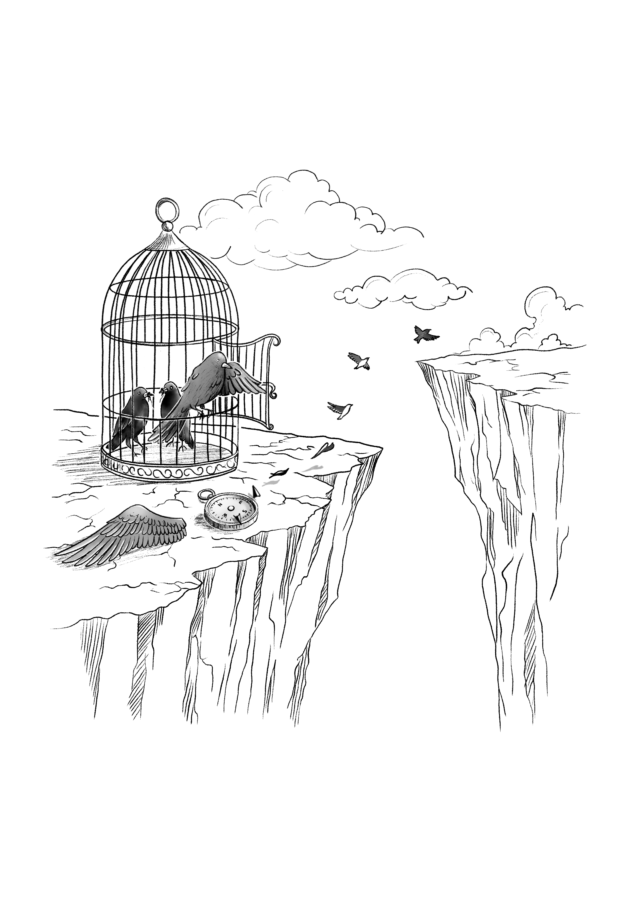

---
title: "2.5"
subtitle: "**Kafesteki Kuşun Evrim Dersi**"
toc: false
---

*Üniversite, yalnızca fikirlerin değil; aynı zamanda ilişkilerin ve suskunlukların da örgütlendiği bir alandır. Bu metin, bir evrim dersinin çevresinde şekillenen sessiz ama derin müdahaleleri görünür kılarken, kendi tanıklığımdan yola çıkarak üniversitenin içsel dönüşümünü sorguluyor. Yaşananlar, kişisel bir kırılmanın ötesinde, kurumsal yapılarla örülü daha geniş bir değişimin izlerini taşıyor. Tanıklığın direnişe dönüştüğü bu anlatı, kamusal olanla kişisel olan arasındaki sınırları geçirgenleştirerek; Darwin’in adının müfredattan çıkarılmaya çalışıldığı bir dönemde, akademik özgürlüğün yalnızca dersliklerde değil, yönetim koridorlarında da nasıl aşındığını gözler önüne seriyor. Bilimsel düşünce, üniversite ideali ve otoriter yapılar arasındaki gerilim tüm açıklığıyla ortaya çıkarken; bu iç muhasebe, ideal bir üniversite fikrinin kırılmasını olduğu kadar, hâlâ yönünü kaybetmemişlerin sessiz direncini de belgelemeye çalışıyor. Belki de bir tür psikanaliz bu: Geçmişten bugüne taşıdıklarımız, bastırdıklarımız ve yüzleşemediklerimiz üzerine kolektif bir düşünme pratiği.*

---
{width=80% fig-align="center"}

*Kafeste doğan kuşlar, uçmanın bir hastalık olduğunu sanırlarmış. Bugün karşı karşıya olduğumuz uçurum, kafeste kalmakla üniversite ideali arasında. Suskunluk, ses çıkarmak isteyenlere yönelen en sessiz baskı biçimidir. Ve bugünlerde evrimi savunmak, yalnızca bir dersin değil; özgür düşüncenin ve özerk üniversitenin de savunusudur.*

2020 yılında, üniversitedeki bölümümde evrim dersini vermeye başladığımda içimde büyük bir heyecan vardı. Yıllardır araştırmalarımda merkezine koyduğum, her tartışmamıza yön veren bir perspektifi artık öğrencilerle doğrudan paylaşacaktım. Dobzhansky’nin o meşhur sözü —“Evrimin ışığı olmaksızın biyolojide hiçbir şeyin anlamı yoktur”— bizim için sadece bir ilke değil, aynı zamanda bir pusulaydı. Bu dersi vermek bir ayrıcalıktı, aynı zamanda da bir sorumluluktu.

Ancak bu heyecan uzun sürmedi. Dersin ilk döneminin ardından bölüm yönetimi değişti. Ve her şey değişti. Hiçbir açıklama yapılmadan, danışma süreci işletilmeden dersin şubesi elimden alındı. Artık bu dersi iki farklı öğretim üyesiyle birlikte vermem gerekiyordu. Akademik özgürlükler, yönetsel kararların gölgesinde sessizce eriyip gitti. İtirazlarım duyulmadı. Dersi paylaşan meslektaşlarım da dahil olmak üzere bölümde bu duruma kimse ses çıkarmadı.
O anda fark ettim: İçinde bulunduğum düzenin normlarıyla, kafamda kurduğum üniversite ideali arasında uçurum vardı. Ve belki de asıl yalnızlık tam burada başlıyordu. Çünkü, Alejandro Jodorowsky'nin o çarpıcı sözü gibi: “Kafeste doğan kuşlar, uçmanın bir hastalık olduğunu sanırlar.”

Ben uçmayı savundum. Oysa çoğu kişi için kafes, hem güvenli hem de olması gerekendi. Demokratik yollarla değişim ararken, aslında kafesin içinde kaldığımı, sistemin otoriter doğasının üniversiteye nasıl nüfuz ettiğini acı bir biçimde anladım. Üstelik bu otorite ilişkileri, belki de bilinçdışımıza işlemiş, ya da hâlâ yanlışlıkla “bilinçaltı” dediğimiz, o derin ve görünmez yapının bir parçasıydı; kimi zaman bireysel, kimi zaman da kurumsal bilinçdışının bir izdüşümü gibi ^[“Kurumsal bilinçdışı” ifadesiyle, psikanalizde bireysel düzeyde tanımlanan bastırma mekanizmalarının, kurumsal yapılarda da benzer biçimde işlediğini kastediyorum. Freud’a göre bilinçdışı, bastırılmış arzuların ve travmaların yüzeye çeşitli dolaylı yollarla sızdığı yapıdır; dil sürçmeleri, rüyalar ya da semptomlar gibi. Örneğin birini yanlışlıkla eski sevgilinin adıyla çağırmak, geçmişte bastırılmış bir duygunun bilinçdışı düzeyden taşması olabilir. Kurumsal yapılarda da, konuşulmayan değerler, bastırılmış çatışmalar ve görünmeyen güç ilişkileri zamanla norm hâline gelir ve karar süreçlerini yönlendirir. Bu bağlamda, üniversite içindeki kimi yönetsel tercihler de bilinçli planlamadan çok, bu “kurumsal bilinçdışı”nın ürünü olabilir.]. Herkes farkındaydı ama kimse konuşmuyordu. Sessizlik doğal sayılıyor, hatta korunuyordu. İşte bu, iki duvarı giderek birbirine yaklaşan dar bir koridor hissi yaratıyordu. Adım attıkça alan daralıyor, sonunda o koridorda durmak bile neredeyse mümkün olmuyordu. Bense bu düzenin içinde, belki de bazıları gibi, iyiden iyiye yabancılaşmış biriydim; dar koridorda direnç göstermeye çalışan ama sürekli gölgede tutulan.

**Kafesin Yapısı: Seçim Gibi Görünen Atama**

Bu dersin elimden alınması, sıradan bir idari değişikliğin sonucu değildi. Öncesinde yaşanan bir bölüm başkanlığı süreci vardı ki, o süreç bile üniversitenin nasıl bir "kafes" olduğunu göstermeye yetiyordu.

Uzun süredir Türkiye üniversitelerinde, rektör atamalarını izleyen dönemlerde fakültelerde ve bölümlerde benzer bir yönetim belirleme düzeni işler. Bu yapının önemli bir yansıması bölüm başkanlıklarının belirlenme biçimidir. Kağıt üzerinde katılımcı gibi görünse de, bu süreçler çoğu zaman fiilî bir seçim niteliği taşımaz. Dekanlar, anabilim dallarının görüşlerini aldıktan sonra kendi takdir hakları doğrultusunda atama yaparlar.

Ancak bu görüş alma aşaması çoğu zaman sınırlı bir açıklıkla yürütülür; adaylar sürecin nasıl şekillendiğini ayrıntılarıyla göremez, yoklamaların hangi ölçütlerle değerlendirildiği net biçimde paylaşılmaz. Seçim kavramı mevzuatta yer almadığı için, kimin hangi gerekçeyle atandığı çoğu zaman dışarıdan tam olarak anlaşılmaz.

Bu uygulama, mensubu olduğum fakültede de uzun süredir benzer biçimde işliyordu. 2021 yılında dekanlık, bölüm içinde yeni bir yönetim belirlemek için bir tür “yoklama” yaptı. Uzun süre hiçbir öğretim üyesi aday olmadı; nedenini tam olarak bilemiyordum. Belki kimse mevcut düzeni sorgulamak istemiyor, belki de çekinceler ağır basıyordu.
Süreç tamamlanmadan birkaç gün önce, tek adaylı bir yoklamanın üniversite etiğine uygun olmadığını düşündüğüm için demokratik bir refleksle aday oldum. Ne hazırlıklıydım ne de bir ekibim vardı; yalnızca destek veren birkaç değerli meslektaşım yanımdaydı. Bugün geriye dönüp baktığımda, bu desteğin de farklı duygu ve beklentilerin iç içe geçtiği karmaşık bir yapısı olabileceğini düşünüyorum.

Yoklama, resmi bir seçim niteliği taşımamakla birlikte, pratikte seçim benzeri bir süreç oluşturdu. Anabilim dallarının görüşleri yasaya uygun bir şekilde dekanlığa iletildi ve değerlendirme sonucunda sonuç benim lehime olmadı.

Bu süreç sonrasında, ben evrim dersini kendi şubemle vermekten uzaklaştırıldım; artık iki öğretim üyesiyle birlikte bir şubeyi idare etmem gerekiyordu. Gerekçe olarak da Bologna süreci ve müfredat gösteriliyor, ortak anlatımlar yapılmasının, evrim içindeki ekoloji, genetik ve sistematik gibi alanların uzmanlarınca ele alınması faydalı olacak deniyordu. Bu otoriter bir karar için sözde akademik bir kılıftı. Evrim, yalnızca üç alandan oluşan bir ders değil; belli bir entelektüel derinlikle, biyolojinin ötesindeki disiplinlerle de bütüncül olarak ele alınmalı ve biyoloji içinde şüphesiz en önemli sentez dersi olarak konumlanmalıydı. Bu, o zamanki yeni bölüm yönetiminin ilk uygulamalarından biri oldu. Dahası, daha önce evrim dersiyle ilgisi olmayan öğretim üyeleri bu derse ortak öğretici olarak dahil edildi ^[Bu başlığın eşlik ettiği yazım, 23 Şubat 2024 tarihinde YetkinReport’ta yayımlanmıştır ve bu yazının son bölümündeki değerlendirmelerim, söz konusu yazının çerçevesine dayanmaktadır. Yazıda, Evrim Teorisi’nin Türkiye’deki eğitim sisteminden nasıl adım adım çıkarıldığını, yerini bilimsellikten uzak yaratılışçı ifadelere nasıl bıraktığını ele aldım. Bu sürecin yalnızca temel eğitimle sınırlı kalmadığını, üniversitelerdeki entelektüel cesaret eksikliğiyle de örtüştüğünü vurguladım. Özellikle, Türkiye Yüzyılı Maarif Modeli kapsamında biyoloji müfredatına “yaratılış teorisinin benimsenmesi” ifadesinin girmesini, Evrim Teorisi’ne yönelik sistematik bir sessiz silinme süreci olarak değerlendirdim. Darwin’in yaşam bilimlerine ve akıl yürütmeye açtığı bilimsel ve felsefi kapının, bugün ideolojik nedenlerle nasıl kapatılmaya çalışıldığını; bunun sadece bilimsel değil, ahlaki ve kamusal sorumluluk alanlarında da ciddi sonuçlara yol açacağını ifade ettim. Evrim karşıtı bu yeni müfredat anlayışını yalnızca bir pedagojik tercih değil, geleceğimizi tehdit eden bir zihniyet dönüşümü olarak ele aldım.]. Ve kimse bu tabloyu açık bir şekilde sorgulamadı.

Bölüm yönetimi bir okul müdüriyeti gibi müfredattan söz ederken, biz öğretim üyeleri de birer öğretmen gibi sadece söyleneni uygulamak zorundaydık sanki. İşte dünün üniversitesi, bugünün ileri lisesi olmuştu.

Bugün geriye baktığımda daha iyi anlıyorum ki, o yoklamada aday olduğumda bile kafesin içindeydim; tartışmaların olması gereken koridora bile alınmak istenmiyordum. Kurallar, usuller, göz boyayan biçimler… hepsi kafesin telinden başka bir şey değildi. Uçmaya çalışmak, koridorda bile yer bulamamaya neden oluyordu. Ve ben uçmaya çalıştıkça, çoğu kişinin neden hiç kanat çırpmadan orada kalmayı seçtiğini daha iyi kavrıyorum.

Ama yine de, yazılı hafıza gereği bu hikâyeyi anlatmam gerekiyordu. Çünkü suskunluk, en sessiz baskı biçimidir. Eğer üniversiteyi gerçekten seçiyorsak, ondan vazgeçmeden çoğalmak istiyorsak, bu hatıraları unutmamalı, birbirimize anlatmalıyız.

**Evrim Dersinden Evrim Mücadelesine**

Bu sürecin ardından, 2024 yılında önceki bölüm yönetiminin süresinin dolması, bölümden hiçbir profesörün bölüm başkanı olmak istememesi ve sorumluluk hissiyle davranmam neticesinde çok kısa bir bölüm başkanlığı dönemi geçirdim. Aslında kitapta yer alan “Görülemeyen Akademi” başlıklı ilk bölümün kapanış yazısında, bu deneyimin nedenlerini içeriden bir gözlemle anlatmaya çalıştım. Görevden ayrıldıktan sonra, her zaman yaptığım gibi kendi imkânlarımla bilgiyi kamuoyuna ulaştırma sorumluluğuyla kendimi motive ettim. Akademik üretimimi uluslararası iş birlikleriyle sürdürürken, üniversite içindeki sessizliğin dışına taşarak konuşmanın en doğru yol olduğuna inandım. Ama belirtmeliyim ki bu bilgiyi paylaşma çabam sadece bir döneme ait değil; zaten hep var olan bir çabaydı. Ne var ki, üniversitede yönetici konumunda olan kişilerin evrim dersi için mücadele ettiklerini söylediği bir dönemde, 2024 yılında Darwin adı bir kez daha Türkiye gündemine geldi; bu kez yasaklanmak üzere, aslında alışık olduğumuz bir şeydi. Akademik sorumluluğum gereği, aynı yıl Yetkin Report’ta yayımladığım bir yazıda, evrim kavramının Türkiye’deki eğitim sisteminden nasıl adım adım silindiğini ve bunun uzun vadeli etkilerini ele aldım. Kamuoyu bu etkileri görmeliydi.

Evrim dersinin içinde yer almak isteyen meslektaşlarım ya da evrimin üniversite müfredatına nasıl dahil edilip edilmeyeceğine karar veren yönetici akademisyenler bu tür gelişmeler karşısında ne yazık ki sessiz kalmayı tercih etti ya da bir ses verdilerse, ben görmedim.

Benim yazımın başlığı, konunun nasıl da sessizce ilerlediğine dikkat çekiyordu: “Darwin’in Türkiye’deki Sessiz Savaşı: Müfredata Yaradılış Teorisi Dahil Edildi.”

Bu mesele, sadece temel eğitimi ilgilendiren bir sorun değildi; üniversitelerdeki sessiz onay, akademik özgürlüğün zedelenmesi ve entelektüel cesaretin gerilemesiyle doğrudan ilişkiliydi.

Biz öğretim üyeleri, “bu dersi kim verecek” gibi dar kadro tartışmalarını aşarak, akademinin düşünen ve üreten bileşenleri olarak, evrim gibi temel bir bilimsel kavramın neden sürekli hedef alındığını sorgulamalıydık. Çünkü evrimsel biyolojiyi savunmak, yalnızca bir dersin değil, çağdaş bilimin ve özgür düşüncenin de savunusudur. Evrim kuramı, sadece biyolojinin değil; aklın, ahlakın ve kamusal sorumluluğun da temel taşlarından biridir.

Türkiye’de evrim, gerek ortaöğretim müfredatındaki yolculuğuyla gerekse üniversite içinde tartışılma biçimiyle, biz akademisyenlere evrimin yalnızca bilimsel bir kuram olmadığını; aynı zamanda düşünsel cesaretin, kamusal sorumluluğun ve ilkesel bir duruşun da sınavına karşılık geldiğini göstermektedir.

Bu alandaki her sessizlik ya da kısır tartışmalar içinde debelenmek, yalnızca bir dersin değil, bir düşünme biçiminin kaybı anlamına gelir. Evrimi anlamak, yaşamı anlamaktır; ve yaşamı anlamaya direnmek, yalnızca bilimden değil, düşünsel sorumluluktan da uzaklaşmaktır.

Bu nedenle akademinin unutmaması, yalnızca bireysel hafızaları değil; aynı zamanda hepimizin ortak etik pusulasını canlı tutmak içindir. Çünkü kimi zaman bir düşüncenin ya da bir yaklaşımın sürdürülebilmesi, onu hangi seslerin sahiplenip savunduğuna bağlıdır.

Bu yazıyı kaleme alırken aklımda hep şu düşünce vardı: Bir öğretim üyesi olarak yalnızca üniversiteye değil, toplumun her kesimine karşı da bir sorumluluğum var. Bu kitap da, işte bu sorumluluğun bir parçası olarak ortaya çıktı. Belleğe, kamu yararına ve susturulmaya çalışılan düşünsel mücadeleye saygıyla yazılmış bir belgedir.

Ve elbette, günümüz üniversitesinin yönetici egemenliğine dayalı yapısına karşı, gecikmiş ama kararlı bir itirazdır.
