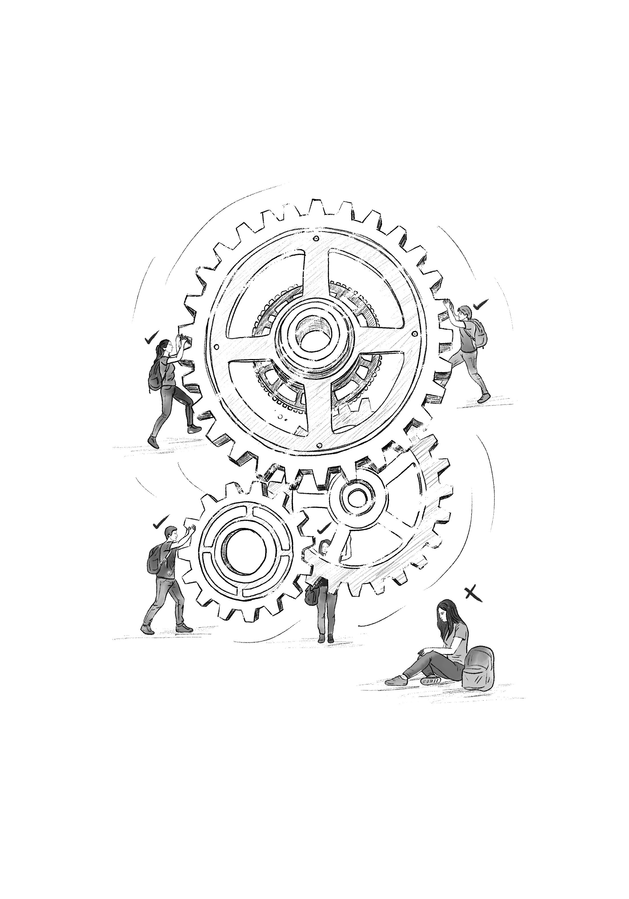

{width=80% fig-align="center"}

<em>Bilginin öznesi değil, çarkların dişlisi: Öğrenci. Merakın ötesinde, sisteme entegre olan öğrenci makbul hale geliyor.</em>

*Burada, üniversitenin dönüşümünü yalnızca yukarıdan gelen yönetimsel müdahalelerle değil, sınıf içinde sessizce kurulan yapılarla da okumaya çalışıyorum. Merak eden bir özne olarak öğrencinin yerini, “memnuniyet anketlerinin nesnesi” hâline gelen, ucuz işgücü olarak konumlanan ve sistemin görünmeyen taşıyıcısı olan bir figür alıyor. Bu ticarileşmiş modelin kurumsallaştırdığı kırılmalar ise yalnızca pedagojik değil; aynı zamanda etik, psikolojik ve yapısal boyutlar taşıyor. Sistem öğrenciyi değersizleştirirken, bu bir tür geri beslemeyle öğrencinin de kendi değer algısını aşındırmasına yol açıyor. Böylece üniversitenin hem düşünsel hem insani zemini aşınıyor.*

Günümüz üniversiteleri yalnızca bilgi üretiminin değil, kırılganlıkların da derinleştiği alanlara dönüşmüş durumda. Ticarileşmiş üniversite modelinde öğrenci, bir zamanlar bilgiye aç bir zihin olarak görülürken, artık çoğu yerde bir müşteri, bir istatistik ya da bir performans metriği olarak değerlendiriliyor. Bu dönüşüm yalnızca derslikleri, not sistemlerini ya da müfredatı etkilemekle kalmıyor; ruh sağlığı, aidiyet hissi ve yaşamın anlamıyla ilgili derin çatlaklar da yaratıyor.

Bu kriz, bireysel değil yapısaldır. Ruth Day’in Birleşik Krallık’ta yaşadıklarıyla Olivia Kong’un ABD’de karşılaştığı sistemsel kayıtsızlık arasında benzerlikler tesadüf değil. Bu örnekler, yükseköğretimin küresel ölçekte nasıl bir çöküş içinde olduğunu gözler önüne seriyor.

Ruth Day, Bristol Üniversitesi’nde öğrenim görürken ruhsal destek talep etmiş; ancak üniversitenin “öğrenime uygunluk” politikası kapsamında derslerden uzaklaştırılmış, kampüse girmesi engellenmiştir. Üniversitenin verdiği mesaj açıktır: “Senin sağlığın bizim sorumluluğumuz değil.” Day bu süreci şöyle tarif eder:

“Hiçbir ruhsal sağlık desteği almadan, geleceğimle ilgili devasa bir soru işaretiyle yaşadığım, belirsizlikler içinde ve yitip gitmiş halde hissettiğim haftalara mahkûm edildim.”

Olivia Kong ise Pensilvanya Üniversitesi’nde ruhsal krizler yaşadığını defalarca okul danışmanlarına bildirmişti. “Pazar günü kampüse dönüp kendimi öldüreceğim,” dediği not dahi sadece dosyalanmış, önlem alınmamıştı. Gerçekten de kampüse döndüğü gün intihar etti. Akademik başarı baskısı, sistemin kayıtsızlığı ve bireysel yükün kurumsal olarak görmezden gelinmesi bu dramatik sonu hazırlamıştı.

Bu örnekler istisna değil; öğrencilerin üretici ama kırılgan, emekçi ama dışlanabilir bir sınıfa dönüştüğü küresel yapının çarpıcı göstergeleridir. Ruh sağlığına dair uluslararası araştırmalar, üniversite öğrencilerinde depresyon, anksiyete ve intihar eğiliminin belirgin biçimde arttığını ortaya koyuyor. Ne var ki pek çok üniversite, bu sorunları yalnızca “bireysel dayanıklılık eksikliği” gibi yorumlamakta, kolektif sorumluluktan ısrarla kaçınmaktadır.

Bu durumu Türkiye’deki bazı uygulamalarda da gözlemlemek mümkün. Üniversite öğrencileri, İŞKUR destekli programlar aracılığıyla çeşitli görevlerde geçici süreyle istihdam edilmektedir ^[Türkiye’de kamu destekli istihdam programları kapsamında üniversite öğrencileri, üniversitelerde İŞKUR aracılığıyla geçici süreyle çeşitli görevlerde çalıştırılmaktadır. Bu durum, yükseköğretim kurumlarında bütçe destekli istihdam politikalarının bir parçası hâline gelmiştir.]. İlk bakışta bu durum, öğrencilerin farklı alanlarda deneyim kazanmaları açısından olumlu görülebilir. Emek sürecine katılmak, bireysel gelişim için destekleyici olabilir. Ancak üniversitenin bilgi üretme misyonu ile karşılaştırıldığında bu uygulama, öğrencinin yaratıcı düşünme ve akademik ilerleme kapasitesinin geri plana atıldığı çelişkili bir tabloyu da beraberinde getiriyor. Merak eden değil, sisteme entegre olan öğrenci makbul hale geliyor. Üniversite içinde istihdam edilen öğrenci, bilginin değil yönetimin çevresinde konumlanıyor.

Türkiye gibi ekonomik baskıların yoğun hissedildiği ülkelerde bu durum daha da derinleşmektedir. Öğrenci emeği, yalnızca bireysel bir geçim stratejisi değil; aynı zamanda üniversitenin görünmeyen destek mekanizması hâline gelmektedir. Bu da yapısal bir çelişkiyi doğurur: Üniversite, ekonomik gerekçelerle asli görevinden saparken, bu sapmayı yine öğrencilerin emeğiyle telafi etmeye çalışmaktadır. Oysa bilgi üreten kurumlar, ancak özgürlük, düşünsel merak ve kurumsal özerklikle var olabilir. Öğrenciyi geçici işgücü olarak konumlandıran bu yaklaşım, üniversitenin eleştirel ve özgürleştirici niteliğini örtük bir biçimde zayıflatmaktadır.
Uluslararası örneklerle birlikte düşünüldüğünde, üniversitenin “müşteri” merkezli yapısının öğrencinin varoluşunu bilgiyle değil verimle ölçtüğü; öğrenci-öğrenme ilişkisinin ise yerini çoktan bir sözleşmeye, hizmete ve memnuniyet skorlarına bıraktığı anlaşılmaktadır. Bilginin değeri, öğrencinin zihninde değil, kayıt sayılarında ve doluluk oranlarında ölçülür hâle gelmiştir. Üniversiteler, öğrencilerini bilgiyle donatmaya değil, endüstriyel bir düzene entegre etmeye çalışmaktadır.
